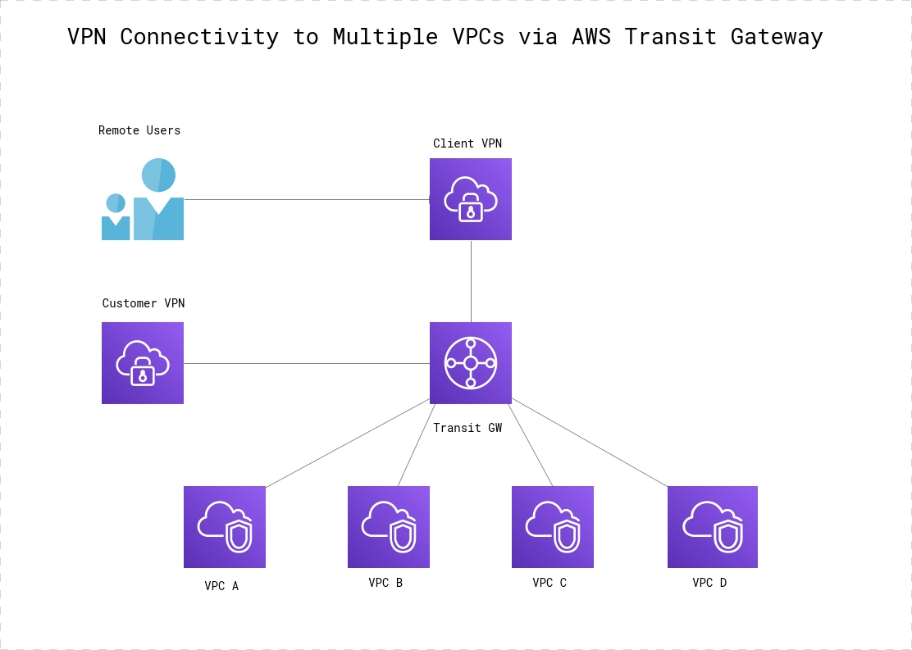

 

**Steps  - Part 1 - Inter VPC Communication**

From the **eu-west-1** region, deploy the following :

1. VPN VPC ( 3 public and 3 private subnets)
2. VPC A   ( 3 public and 3 private subnets)
3. VPC B   ( 3 public and 3 private subnets)
4. VPC C   ( 3 public and 3 private subnets)
5. VPC D   ( 3 public and 3 private subnets)
6. Create a Transit Gateway in the VPN VPC
7. Create Attachments for VPC A, VPC B, VPC C & VPC D
8. Modity subnets for all VPCs to route traffic through the Transit Gateway
9. Launch EC2 instances into VPCs A to D. Instances should be deployed into private subnets
10. Connect to the VPN and verify connectivity to all instances. 

**Steps - Part 2 - IPSEC VPN Communication (Customer VPN)**
